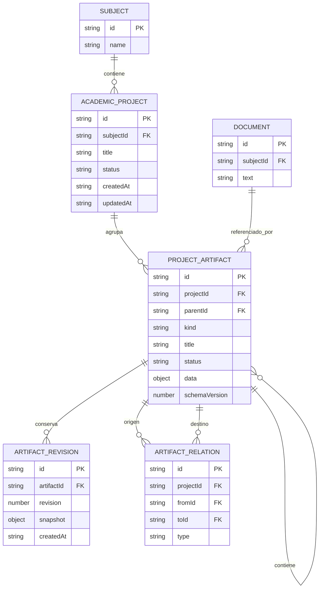
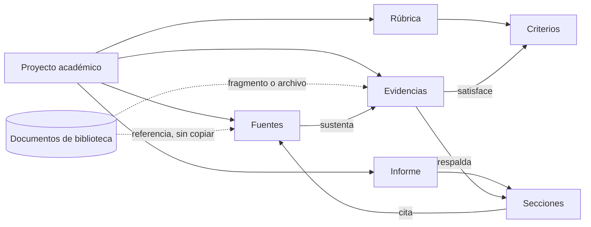

# Arquitectura del núcleo académico de FORJA

Estado: aprobado e implementado internamente, sin interfaz  
Fecha: 2026-07-26  
Alcance: diseño de datos y arquitectura. No autoriza interfaz ni implementación funcional.

## 1. Decisión principal

`Proyecto Académico` será la raíz de todo trabajo universitario en FORJA.

Una asignatura puede contener varios proyectos. Cada instrucción, objetivo, fuente, criterio de rúbrica, evidencia, borrador o entrega pertenece a un proyecto y conserva relaciones explícitas con los elementos que justifican su existencia.

FORJA no almacenará copias separadas de un mismo archivo para cada función. La biblioteca seguirá siendo el lugar físico de los documentos; el núcleo académico guardará referencias a esos documentos y explicará qué papel cumplen dentro de cada proyecto.

## 2. Principios

1. Un proyecto es una unidad de trabajo completa, no una carpeta visual.
2. Los elementos académicos comparten identidad, proyecto, estado y fechas.
3. Las relaciones importantes se guardan como datos, no se infieren por nombres.
4. Una fuente no es lo mismo que un archivo.
5. Una evidencia no es lo mismo que un documento: explica qué demuestra y para qué criterio.
6. Una rúbrica contiene criterios identificables y comprobables.
7. Un informe conserva la trazabilidad hasta sus fuentes, evidencias y criterios.
8. El contenido existente no se mueve ni se reescribe automáticamente.
9. Toda migración es aditiva, transaccional y reversible mediante respaldo.
10. La interfaz futura consultará el núcleo; el núcleo no dependerá del DOM.

## 3. Diagrama del núcleo



## 4. Flujo académico inicial



El flujo no obliga a completar cada elemento en orden. Obliga a que el informe final pueda responder:

- qué pidió el trabajo;
- qué criterio intenta cumplir;
- qué evidencia lo demuestra;
- de qué fuente o documento proviene;
- dónde se utilizó en el informe.

## 5. Entidades

### 5.1 `subjects` — existente

Representa una asignatura. Se conserva sin cambios.

Relación: una asignatura tiene cero o muchos proyectos. En esta primera versión cada proyecto tiene una sola asignatura principal.

### 5.2 `academicProjects` — nueva

Es la raíz y frontera de consistencia.

Campos propuestos:

```js
{
  id,
  subjectId,
  title,
  description,
  status: 'active' | 'submitted' | 'graded' | 'archived',
  createdAt,
  updatedAt,
  submittedAt: null,
  archivedAt: null
}
```

No incluirá fuentes, rúbricas o documentos como arreglos embebidos. Eso impediría consultar, versionar y relacionar cada elemento de forma independiente.

### 5.3 `projectArtifacts` — nueva

Catálogo común de todo elemento académico que vive dentro de un proyecto.

```js
{
  id,
  projectId,
  parentId: null,
  kind,
  title,
  status: 'draft' | 'ready' | 'final' | 'archived',
  position: 0,
  data: {},
  schemaVersion: 1,
  createdAt,
  updatedAt
}
```

`kind` es un discriminador cerrado. Cada tipo tiene un esquema validado; `data` no acepta propiedades arbitrarias.

Tipos previstos por el modelo:

- `instruction`
- `objective`
- `research_note`
- `source`
- `document_ref`
- `rubric`
- `rubric_criterion`
- `evidence`
- `draft`
- `report`
- `report_section`
- `presentation`
- `study_set`
- `evaluation`
- `grade`
- `observation`

La primera implementación solo habilitará los tipos necesarios para:

- fuente;
- documento referenciado;
- rúbrica;
- criterio;
- evidencia;
- informe;
- sección de informe.

Los otros tipos reservan contratos futuros, pero no crean funciones ni pantallas.

### 5.4 `artifactRelations` — nueva

Conecta artefactos del mismo proyecto sin duplicarlos.

```js
{
  id,
  projectId,
  fromId,
  toId,
  type,
  note: '',
  createdAt
}
```

Relaciones permitidas inicialmente:

- `derived_from`: una evidencia o sección se deriva de otro elemento;
- `supports`: una evidencia respalda una sección u objetivo;
- `satisfies`: una evidencia o sección satisface un criterio;
- `cites`: una sección utiliza una fuente;
- `responds_to`: una parte del trabajo responde a una instrucción;
- `attached_to`: un documento está adjunto a una fuente o evidencia.

No existirá una relación genérica llamada `related`. Si no puede explicarse el significado del vínculo, no debe guardarse.

### 5.5 `artifactRevisions` — nueva

Conserva hitos, no cada pulsación del teclado.

```js
{
  id,
  artifactId,
  projectId,
  revision,
  snapshot,
  reason: 'manual' | 'submitted' | 'restored',
  createdAt
}
```

Sirve para mantener borradores, entregas y correcciones sin convertir `projectArtifacts` en un historial infinito.

### 5.6 `documents` — existente

Continúa almacenando el texto extraído y los metadatos del archivo una sola vez.

Un artefacto `document_ref` contendrá:

```js
{
  documentId,
  role: 'source_file' | 'instruction_file' | 'evidence_file' | 'working_file'
}
```

El mismo documento puede vincularse a varios proyectos mediante referencias distintas. El texto no se copia.

### 5.7 Esquemas académicos del primer flujo

Fuente:

```js
{
  sourceType: 'book' | 'article' | 'website' | 'manual' | 'standard' | 'other',
  authors: [],
  publicationTitle: '',
  publisher: '',
  year: null,
  url: '',
  accessedAt: null,
  notes: ''
}
```

Rúbrica:

```js
{ description: '', totalPoints: null, scaleLabel: '' }
```

Criterio de rúbrica:

```js
{
  code: '',
  description: '',
  maxPoints: null,
  weight: null,
  required: true
}
```

Evidencia:

```js
{
  summary: '',
  excerpt: '',
  locator: { page: null, section: '', timestamp: null },
  confidence: 'unverified' | 'reviewed' | 'confirmed'
}
```

Informe:

```js
{ reportType: 'academic', abstract: '', language: 'es' }
```

Sección de informe:

```js
{ heading: '', body: '' }
```

## 6. Reglas de integridad

- Todo proyecto referencia una asignatura existente.
- Todo artefacto referencia un proyecto existente.
- `parentId`, cuando existe, pertenece al mismo proyecto.
- Un criterio tiene como padre una rúbrica.
- Una sección tiene como padre un informe.
- Los dos extremos de una relación pertenecen al mismo proyecto.
- No se permiten relaciones de un artefacto consigo mismo.
- La combinación `projectId + fromId + toId + type` es única.
- Un `document_ref` siempre apunta a un documento existente.
- Eliminar un proyecto no elimina documentos de la biblioteca.
- Un proyecto entregado no puede modificarse sin volver a estado activo o crear revisión.
- Los estados, tipos y formas de `data` se validan antes de llegar a IndexedDB.
- Las operaciones que cambian varias entidades usan una sola transacción.

## 7. Índices de IndexedDB

`academicProjects`:

- `subjectId`
- `status`
- `updatedAt`
- compuesto `[subjectId, status]`

`projectArtifacts`:

- `projectId`
- `parentId`
- `kind`
- `updatedAt`
- compuesto `[projectId, kind]`
- compuesto `[projectId, parentId]`

`artifactRelations`:

- `projectId`
- `fromId`
- `toId`
- compuesto `[projectId, type]`

`artifactRevisions`:

- `artifactId`
- `projectId`
- compuesto `[artifactId, revision]`, único

La aplicación no cargará todos los proyectos ni artefactos al arrancar. Consultará por proyecto e índice.

La estrategia de migración, arquitectura de código, riesgos, fases y resultados están en [ACADEMIC_CORE_DELIVERY.md](ACADEMIC_CORE_DELIVERY.md).
