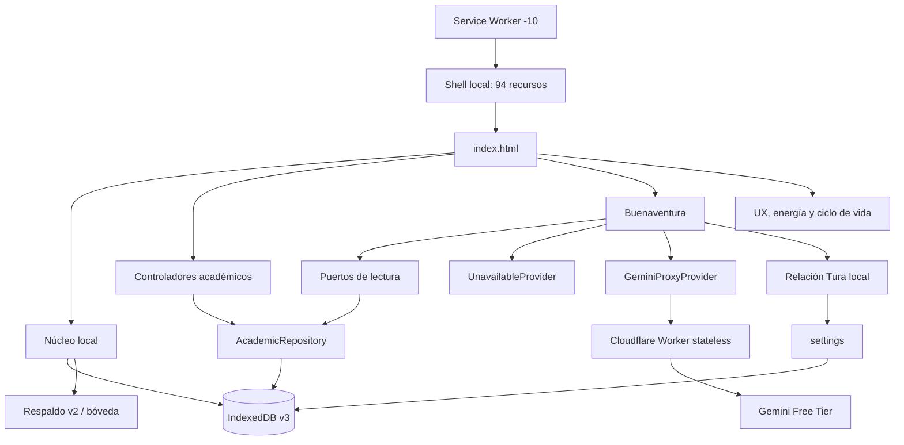

# FORJA — Arquitectura final y certificación técnica

Fecha de consolidación: 2026-07-28

Base certificada: historial 6A → 6B → 6C

Estado: candidato técnico; publicación y comprobaciones físicas pendientes.

Este documento es la fuente final de cierre. Los informes 6A, 6B y 6C conservan
la evidencia detallada, pero no deben utilizarse como estado operativo actual.

## 1. Decisiones canónicas

- FORJA es local-first. IndexedDB es la autoridad de datos del navegador.
- La interfaz académica escribe únicamente mediante `AcademicRepository`.
- IndexedDB permanece en versión 3 y el respaldo en versión 2.
- El Service Worker es `2026.07.28-10`.
- La sincronización automática continúa desactivada.
- Buenaventura solo puede `OBSERVE` y `RECOMMEND`; nunca escribe datos.
- El contexto externo es explícito, desidentificado y de un solo proyecto.
- Gemini usa exclusivamente `gemini-3.5-flash-lite` en Free Tier.
- El proxy es stateless y permanece en Cloudflare Workers Free.
- No existe fallback pagado ni activación automática de facturación.
- Tura cambia únicamente el nombre y matices de voz, siempre con trato de usted.
- La evolución es opt-in, global, cualitativa y no concede permisos.
- No existe memoria conversacional, historial de IA ni puntuación relacional.
- Los 77 módulos continúan con carga inicial: no se autorizó carga diferida.
- Ningún archivo puede superar 400 líneas.

## 2. Arquitectura general y conexiones



### Entradas del navegador

`index.html` inicia nueve controladores:

1. núcleo local;
2. proyectos;
3. fuentes;
4. rúbricas;
5. evidencias;
6. informes;
7. Buenaventura;
8. presentaciones;
9. experiencia de uso.

El auditor alcanza los 77 módulos JavaScript de producción. No encontró módulos
desconectados, duplicados por contenido ni código demostrado como muerto.
`sync-worker/` y `buenaventura-proxy/` son despliegues separados del navegador.

### Flujo académico

`Asignatura → Proyecto → Fuente → Rúbrica/Criterio → Evidencia → Informe/Sección
→ Presentación`.

Los documentos viven una sola vez en Biblioteca. Artefactos y relaciones
conservan trazabilidad dentro del mismo proyecto. Presentaciones exportan un
paquete local compatible con una integración futura, pero NEXUS no forma parte
de este cierre.

## 3. Datos, respaldo y restauración

### IndexedDB v3

Base: `forja-estudio`.

Stores legacy:

- `subjects`;
- `documents`;
- `cards`;
- `attempts`;
- `settings`.

Stores académicos:

- `academicProjects`;
- `projectArtifacts`;
- `artifactRelations`;
- `artifactRevisions`.

La migración v2 → v3 es aditiva y transaccional. La apertura compatible nunca
solicita una versión inferior a la instalada.

### Respaldo v2

- Conserva los cinco stores legacy y los cuatro académicos.
- Incluye `buenaventuraRelationship` dentro de `settings` sin cambiar formato.
- Convierte respaldo v1 a v2 solo en memoria.
- Valida versiones, límites, claves cerradas, referencias e integridad.
- Restaura todos los stores en una transacción; un fallo no deja datos parciales.
- Límite JSON: 10 MB. Bóveda cifrada: 16 MB.
- No existe respaldo v3 porque no hay cambio técnico de contrato que lo exija.

## 4. PWA, offline y actualización

- El shell `forja-shell-2026.07.28-10` contiene 94 recursos locales.
- `cache.addAll` falla de forma cerrada ante una ruta inexistente.
- Navegación offline cae a `index.html`; recursos estáticos usan caché.
- La actualización desde `2026.07.28-9` elimina la caché anterior y conserva la
  nueva sin acceder a IndexedDB.
- Worker, Gemini, datos académicos y datos de usuario no se precargan.
- El manifiesto usa `display: standalone`.
- La aplicación conserva ambas etiquetas `mobile-web-app-capable`.

## 5. Buenaventura, Gemini y Tura

### Solicitud

- Un solo proyecto por solicitud.
- Hasta cuatro fragmentos.
- Máximo 2.000 caracteres por fragmento y 8.000 en total.
- Cada fragmento declara alias, módulo, tipo, proyecto y procedencia local.
- Se exige selección explícita, vista previa, consentimiento específico,
  desidentificación y confirmación de mayoría de edad.
- El proxy recibe tarea, fragmentos, consentimientos e `identityStage`.
- No recibe hitos, fechas, historial, configuración ni razones de transición.

### Proveedor gratuito

- Modelo fijo: `gemini-3.5-flash-lite`.
- Endpoint fijo de FORJA:
  `https://forja-buenaventura-free.informesinap937.workers.dev/v1/buenaventura/recommend`.
- Origen CORS: `https://unporciento.github.io`.
- `GEMINI_API_KEY` existe únicamente como secreto del Worker.
- El Worker no declara KV, D1, R2, Durable Objects, Queues ni almacenamiento.
- Límites observados en AI Studio para el proyecto Free el 2026-07-28:
  15 RPM, 250.000 TPM y 500 RPD. Deben reconfirmarse antes de publicar porque
  Google puede modificarlos.
- Cuota agotada produce `quota_exhausted`; otros fallos seguros producen
  `provider_unavailable`. FORJA local sigue disponible.
- No hay modelo alternativo, proveedor alternativo ni fallback pagado.

### Evolución Tura

Secuencia única:

`Profesor Buenaventura → Buenaventura → Profesor Tura → Tura`.

Comienza con `evolutionEnabled: false`. La política local usa predicados
booleanos sobre familias cualitativas, sesiones separadas y diversidad de
tareas. No suma, puntúa ni cuenta mensajes o aciertos. Las transiciones ocurren
en orden, una por vez, después de una acción completa y fuera de evaluaciones.
Gemini no decide transiciones.

Las cuatro voces mantienen usted, rigor, consentimiento, contexto mínimo, cero
escrituras y permisos idénticos. Desactivar congela la etapa; eliminar restaura
Profesor Buenaventura.

## 6. Rendimiento medido

Presupuestos de no regresión para el entorno 6A:

| Medida | Presupuesto | Evidencia |
| --- | ---: | ---: |
| LCP producción escritorio | ≤ 1.000 ms | 788 ms |
| CLS producción | ≤ 0,02 | 0,0092 |
| carga completa producción | ≤ 1.200 ms | 958,4 ms |
| heap JS inicial | ≤ 8 MB | 6,86 MB |
| transferencia inicial | ≤ 250 kB | 199.966 B |
| consulta indexada de grafo grande | ≤ 2.000 ms | 6,8 ms |
| carga del grafo grande | ≤ 35 s | 18,16–22,62 s |

Con CPU 4× y Fast 3G:

- LCP frío local: 2,861 s;
- LCP caliente con Service Worker: 0,952 s;
- CLS: 0,00;
- navegación repetida: mediana 90,1 ms por vista;
- diálogo repetido: mediana 108,6 ms por ciclo;
- página productiva de 60 proyectos: mediana 590,5 ms.

La primera carga local limitada no justifica carga diferida: mezcla HTTP/1.1,
caché HTTP desactivada e instalación completa. Debe medirse en dispositivos
físicos antes de reconsiderar P4.

## 7. Matriz móvil, accesibilidad y segundo plano

| Área | Resultado automatizado/emulado | Pendiente físico |
| --- | --- | --- |
| PC y teclado | aprobado | — |
| Android Chrome | sin desbordamiento | recomendada confirmación |
| Tablet vertical/horizontal | sin desbordamiento | recomendada confirmación |
| iPhone estrecho | emulación aprobada | Safari real |
| Teclado virtual | aproximación aprobada | iPhone real |
| Orientación con diálogo | emulación aprobada | dispositivo real |
| Texto al 200 % | aprobado | revisión visual |
| Lighthouse escritorio/móvil | accesibilidad 100; 0 fallos | — |
| PWA standalone/offline | determinista aprobado | instalación iPhone |
| Batería/segundo plano | cero intervalos y solicitudes finales | medición física |

`prefers-reduced-motion`, modo ahorro y `data-page-hidden` detienen animaciones
o tareas evitables. ExamSession mantiene como máximo un intervalo y termina en
cero después de abandonar repetidamente. No existen llamadas Gemini ni
reintentos automáticos en segundo plano.

## 8. Hechos, riesgos, manuales y pospuestos

### Hechos medidos

- 77 módulos conectados y shell completo.
- IndexedDB v3, respaldo v2 y restauración atómica aprobados.
- Service Worker -10 instala, actualiza y navega offline.
- Lighthouse de accesibilidad: 100 en escritorio y móvil.
- Suite completa y límites de archivos aprobados en 6C.

### Riesgos conocidos y aceptados

- La carga inicial evalúa 77 módulos; no hay regresión productiva demostrada.
- Google Fonts y parsers dinámicos dependen de red para apariencia/importación.
- Los límites Free pueden cambiar sin intervención de FORJA.
- El proxy gratuito puede quedar temporalmente sin cuota o disponibilidad.
- Las mediciones de heap y segundo plano no sustituyen instrumentos físicos.

### Validaciones manuales obligatorias antes del cierre público

- Safari en iPhone real.
- PWA instalada en iPhone.
- Teclado virtual real.
- Cambio real de orientación con diálogos abiertos.
- Consumo físico de batería.
- Revisión visual de colores personalizados claros.

### Pospuesto

- Carga diferida.
- Sincronización remota.
- Laboratorio.
- NEXUS.
- Nuevos proveedores, modelos o niveles pagados.

## 9. Checklist de certificación

Estados: `[x]` validación automatizada o inspección reproducible; `[ ]` manual
pendiente.

- [x] Módulos funcionales y 77 imports alcanzables.
- [x] Nueve entradas y conexiones sin módulos muertos demostrados.
- [x] Flujo académico y aislamiento entre proyectos.
- [x] Respaldo v1/v2, corrupción y restauración atómica.
- [x] Migración v2 → v3 y reapertura compatible.
- [x] PWA, instalación nueva, actualización -9 → -10 y offline determinista.
- [x] Lighthouse 100 y nombres/contraste accesibles.
- [x] Presupuestos y volúmenes medidos.
- [x] Cero temporizadores huérfanos y cero llamadas Gemini de fondo.
- [x] PC, teclado, móvil y orientación emulados.
- [x] Buenaventura: contexto, consentimiento, desidentificación y cero escritura.
- [x] Tura: opt-in, usted, etapas ordenadas y cero puntuación.
- [x] Gemini/Cloudflare configurados solo para niveles Free.
- [x] Secreto ausente del frontend, repositorio y respaldos.
- [x] Pruebas focalizadas, rápidas y completas.
- [x] Todos los archivos bajo 400 líneas.
- [x] `git diff --check`.
- [ ] Safari en iPhone real.
- [ ] PWA instalada en iPhone.
- [ ] Teclado virtual y orientación reales.
- [ ] Medición física de batería.
- [ ] Revisión visual de paletas claras.
- [x] Working tree limpio en el commit final.
- [ ] Publicación fast-forward y validación de GitHub Pages.

## 10. Verificación reproducible

```powershell
npm.cmd ci
node --test tests\closure-6a-audit.test.js tests\service-worker.test.js
node --test tests\academic-migrations.test.js tests\academic-vertical.test.js
node --test tests\buenaventura-contracts.test.js tests\buenaventura-proxy.test.js
node --test tests\buenaventura-relationship.test.js tests\buenaventura-relationship-store.test.js
npm.cmd run verify:quick
npm.cmd run verify
git diff --check
git status --short
```

Auditoría de secretos de alta confianza:

```powershell
rg -n --hidden --glob "!node_modules/**" --glob "!.git/**" `
  "AIza[0-9A-Za-z_-]{35}|-----BEGIN (RSA |EC |OPENSSH )?PRIVATE KEY-----|gh[pousr]_[0-9A-Za-z]{30,}"
```

Los nombres `GEMINI_API_KEY` y otros identificadores de configuración pueden
estar documentados; ningún valor secreto debe aparecer.

## 11. Publicación y reversión

Publicación propuesta, solo después de aprobación:

1. Repetir la sección 10 y las seis validaciones manuales.
2. Publicar `module/closure-6d-final-certification`.
3. Verificar que `origin/main` siga en el commit base aprobado.
4. Integrar exclusivamente mediante `git merge --ff-only`.
5. Publicar `main`, esperar GitHub Pages y validar versión, PWA, offline,
   Buenaventura sintético, CORS y ausencia de secretos.

Reversión sin reescribir historial:

1. crear una rama desde el `main` publicado;
2. revertir el rango del Módulo 6 en un commit nuevo;
3. ejecutar verificación completa;
4. integrar el commit de reversión mediante fast-forward;
5. validar GitHub Pages y caché anterior/nueva.

No usar `reset --hard`, force-push ni restaurar IndexedDB automáticamente.

## 12. Criterios para declarar FORJA cerrada

FORJA puede declararse cerrada cuando:

1. este checklist automatizado permanezca aprobado;
2. las seis validaciones físicas/manuales tengan evidencia;
3. los límites Free y ausencia de facturación se reconfirmen;
4. la rama se publique y `main` avance únicamente por fast-forward;
5. GitHub Pages cargue online/offline sin mezclar versiones;
6. una consulta sintética confirme CORS y degradación segura;
7. el commit publicado quede limpio y sin secretos;
8. los riesgos aceptados se mantengan documentados;
9. no exista trabajo de NEXUS, sincronización o nuevas funciones mezclado.
