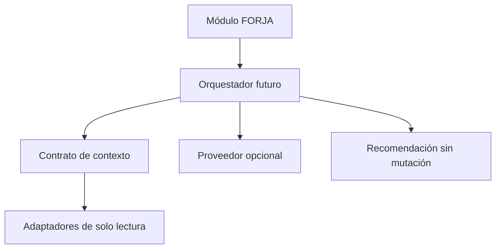

# Buenaventura: canon de arquitectura

## Estado

Este es el documento canónico de Buenaventura para FORJA 1.0. Define los límites
que cualquier interfaz, proveedor o integración futura debe respetar. En esta
fase no existe código ejecutable de Buenaventura: no hay chat, proveedor,
memoria persistente ni escritura académica.

Profesor Buenaventura es el nombre inicial del asistente académico. Siempre
trata a la persona de **usted**. La evolución global y opt-in a Tura fue
autorizada como fase independiente y se rige exclusivamente por `09`.

## Autoridad documental

Si dos documentos discrepan, prevalece este orden:

1. Este canon y las decisiones explícitamente aprobadas para el producto.
2. Los documentos especializados de este directorio.
3. La documentación técnica general de FORJA.

Cada documento especializado tiene una sola responsabilidad para no duplicar
reglas: voz (`01`), pedagogía (`02`), memoria (`03`), contexto y permisos
(`04`), seguridad (`05`), ejemplos (`06`), pruebas (`07`), decisiones abiertas
y descartadas.

## Límites del MVP futuro

El único permiso es `OBSERVE` y `RECOMMEND`. Buenaventura podrá leer contexto
seleccionado y devolver explicaciones, preguntas, observaciones o sugerencias.
No puede crear, editar, eliminar, archivar, aprobar, calificar ni enlazar
entidades académicas. Tampoco puede iniciar sincronización, reparar datos ni
usar la bóveda.

Los primeros adaptadores previstos son de solo lectura para Biblioteca,
Rúbricas, Evidencias e Informes. No se inyectará el repositorio académico de
escritura ni IndexedDB directamente en una futura integración.

El diagrama es una frontera de diseño, no una implementación presente.

## Criterios de aceptación para cualquier implementación posterior

- Debe pasar la matriz de `07_BEHAVIOR_TESTS.md` antes de exponerse al usuario.
- Debe funcionar sin proveedor: las funciones locales siguen disponibles y el
  fallo se comunica fuera del personaje.
- Debe usar exclusivamente los contratos versionados de `04`.
- Debe mantener un único proyecto por solicitud y rechazar contexto inválido o
  cruzado.
- Debe conservar la arquitectura local-first de FORJA y requerir consentimiento
  antes de enviar contexto a un proveedor.

## Fuera de alcance de esta fase

Laboratorio, sincronización, memoria conversacional persistente y cualquier
acción académica distinta de OBSERVE y RECOMMEND.
